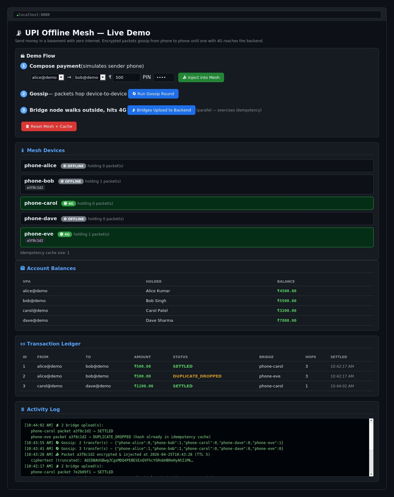

# UPI Offline Mesh — Demo

A Spring Boot backend that demonstrates **offline UPI payments routed through a Bluetooth-style mesh network**. You're in a basement with zero connectivity. You send your friend ₹500. Your phone encrypts the payment, broadcasts it to nearby phones, and the packet hops device-to-device until *some* phone walks outside, gets 4G, and silently uploads it to this backend. The backend decrypts, deduplicates, and settles.

This repo is the **server side** of that system, plus a software simulator of the mesh so you can demo the whole flow on a single laptop without any real Bluetooth hardware.

---
## Live Demo

---

## Table of Contents

1. [What this demo proves](#what-this-demo-proves)
2. [How to run it](#how-to-run-it)
3. [The demo flow (step by step)](#the-demo-flow-step-by-step)
4. [Architecture](#architecture)
5. [The three hard problems and how they're solved](#the-three-hard-problems-and-how-theyre-solved)
6. [File-by-file walkthrough](#file-by-file-walkthrough)
7. [API reference](#api-reference)
8. [Tests](#tests)
9. [What's NOT real (and what would change for production)](#whats-not-real-and-what-would-change-for-production)
10. [Honest limitations of the concept](#honest-limitations-of-the-concept)

---

## What this demo proves

The system shows three things working end to end:

1. **A payment can travel from sender to backend through untrusted intermediaries** without any of them being able to read or tamper with it. (Hybrid RSA + AES-GCM encryption.)
2. **Even if the same payment reaches the backend simultaneously through multiple bridge nodes, it settles exactly once.** (Idempotency via atomic compare-and-set on the ciphertext hash.)
3. **A tampered, replayed, or wrong-PIN packet is rejected** before it touches the ledger.

You'll see all three in the dashboard.

---

## How to run it

### Prerequisites

- **JDK 17 or newer** installed and on PATH (or `JAVA_HOME` set). Check with `java -version`.
- **Node.js 18 or newer** for the React frontend. Check with `node -v`.
- No database, no Redis, no global Maven needed. The Maven wrapper handles the backend.

### Run the backend (Spring Boot)

Open a terminal in the project root and run:

**Windows:**
```cmd
mvnw.cmd spring-boot:run -Dspring-boot.run.profiles=dev
```

**Mac/Linux:**
```bash
./mvnw spring-boot:run -Dspring-boot.run.profiles=dev
```

> The `dev` profile enables the H2 console at `http://localhost:8080/h2-console`. Without it, the console is disabled.

The first run downloads Maven (~10 MB) and all dependencies (~80 MB) — give it a couple of minutes. Subsequent runs start in a few seconds.

Once you see `Started UpiMeshApplication in X.XXX seconds`, the backend is ready on port 8080.

### Run the frontend (React + Vite)

Open a second terminal in the `frontend/` folder:

```bash
cd frontend
npm install
npm run dev
```

Once Vite starts, open: **http://localhost:5173**

You'll get a dark React dashboard with everything you need to drive the demo.

### Stop

`Ctrl+C` in both terminals.

### Run the tests

```cmd
mvnw.cmd test
```

The interesting one is `IdempotencyConcurrencyTest` — it fires three threads delivering the same packet simultaneously and asserts that exactly one settles.

---

## The demo flow (step by step)

The dashboard has four controls that walk through the full pipeline. The intended sequence:

### Step 1 — Compose a payment

Choose sender VPA (`alice@demo`, `bob@demo`, or `carol@demo`), receiver, amount, and PIN. Click **"📤 Inject into Mesh"**.

**What actually happens on the backend:**
- The server pretends to be the sender's phone, injected at that sender's corresponding mesh device.
- It builds a `PaymentInstruction` with a unique nonce and current timestamp.
- It encrypts that with the server's RSA public key (hybrid encryption — see below).
- It wraps the ciphertext in a `MeshPacket` with a TTL of 5.
- The packet is injected at the sender's device (`alice@demo` → `phone-alice`, `bob@demo` → `phone-stranger1`, `carol@demo` → `phone-stranger2`).

You'll see the sender's device now holds 1 packet.

### Step 2 — Run gossip rounds

Click **"🔄 Run Gossip Round"**. Then click it again.

Each round, every device that holds a packet broadcasts it to every other device within "Bluetooth range" (which, in the simulator, means everyone). TTL decrements per hop.

After 1–2 rounds: every device holds the packet.

In the real system this would happen organically as people walk past each other in the basement.

### Step 3 — Bridge nodes walk outside

Click **"📡 Bridges Upload to Backend"**.

`phone-bridge` and `phone-bridge2` are the two devices with `hasInternet=true`. The dashboard simulates them walking outside and getting 4G. Each POSTs every packet it holds to `/api/bridge/ingest`.

The backend pipeline runs:
1. Hash the ciphertext (`SHA-256`).
2. Try to claim the hash in the idempotency cache (atomic `putIfAbsent`).
3. If claimed: decrypt with the server's RSA private key.
4. Verify freshness (signedAt within 24 hours).
5. Verify PIN against the sender's stored PIN hash.
6. Run the debit/credit in a single DB transaction.

Watch the **Account Balances** table — money has moved. Watch the **Transaction Ledger** — a new row appears. The second bridge node's delivery shows as `DUPLICATE_DROPPED`.

### Step 4 — Demonstrate idempotency (the killer feature)

Because the mesh now has **two bridge nodes** (`phone-bridge` and `phone-bridge2`), both will hold the packet after gossip and both will attempt to upload it. Only the first one to claim the ciphertext hash settles — the second is short-circuited as `DUPLICATE_DROPPED`. No double-debit, no double-credit.

To exercise the *concurrent duplicate* case properly, run the test:
```cmd
mvnw.cmd test -Dtest=IdempotencyConcurrencyTest#singlePacketDeliveredByThreeBridgesSettlesExactlyOnce
```

This test creates one packet, fires 3 threads at `BridgeIngestionService.ingest()` simultaneously, and verifies that exactly one settles, two are dropped as duplicates, and the sender is debited exactly once.

---

## Architecture

```
┌─────────────────────────────────────────────────────────────────────────┐
│                         SENDER PHONE (offline)                          │
│  PaymentInstruction { sender, receiver, amount, pinHash, nonce, time }  │
│              │                                                          │
│              ▼ encrypt with server's RSA public key                     │
│   MeshPacket { packetId, ttl, createdAt, ciphertext }                   │
└──────────────────────────────────────┬──────────────────────────────────┘
                                       │ Bluetooth gossip
                                       ▼
        ┌─────────┐  hop   ┌─────────┐  hop   ┌──────────┐  ┌──────────┐
        │stranger1│ ─────▶ │stranger2│ ─────▶ │ bridge   │  │ bridge2  │
        └─────────┘        └─────────┘        └────┬─────┘  └────┬─────┘
                                                   │              │
                                            walk outside    walk outside
                                                   │              │
                                                   ▼              ▼
                                              HTTPS POST    HTTPS POST
┌─────────────────────────────────────────────────────────────────────────┐
│                     SPRING BOOT BACKEND (this project)                  │
│                                                                         │
│  /api/bridge/ingest                                                     │
│       │                                                                 │
│       ▼                                                                 │
│  [1] hash ciphertext (SHA-256)                                          │
│       │                                                                 │
│       ▼                                                                 │
│  [2] IdempotencyService.claim(hash)  ◀── atomic putIfAbsent (≈ Redis    │
│       │                                  SETNX). Duplicates rejected    │
│       │                                  here, before any work.         │
│       │                                  release(hash) called on INVALID│
│       ▼                                                                 │
│  [3] HybridCryptoService.decrypt(ciphertext)                            │
│       │       (RSA-OAEP unwraps AES key, AES-GCM decrypts payload       │
│       │        AND verifies the auth tag — tampering = exception)       │
│       ▼                                                                 │
│  [4] Freshness check: signedAt within last 24h                          │
│       │                                                                 │
│       ▼                                                                 │
│  [5] PIN verification: instruction.pinHash == account.pinHash           │
│       │                                                                 │
│       ▼                                                                 │
│  [6] SettlementService.settle()                                         │
│       @Transactional: debit sender, credit receiver, write ledger       │
│       @Version on Account = optimistic locking (defense in depth)       │
└─────────────────────────────────────────────────────────────────────────┘
```

---

## The three hard problems and how they're solved

### Problem 1: Untrusted intermediates

A random stranger's phone is carrying your transaction. How do you stop them from reading the amount or changing it?

**Solution: Hybrid encryption (RSA-OAEP + AES-GCM).**

The sender encrypts the payload with the server's public key. Only the server holds the private key, so intermediates see opaque ciphertext.

But RSA can only encrypt small data (~245 bytes for a 2048-bit key), and our payload is JSON that could exceed that. So we use the standard hybrid pattern:

1. Generate a fresh AES-256 key for *this packet*.
2. Encrypt the JSON with **AES-256-GCM** (fast + authenticated).
3. Encrypt just the AES key with **RSA-OAEP**.
4. Concatenate: `[256 bytes RSA-encrypted AES key][12 bytes IV][AES ciphertext + 16-byte GCM tag]`.

**Why GCM specifically?** It's authenticated encryption. If an intermediate flips one bit anywhere in the ciphertext, decryption throws an exception — the GCM tag won't verify. The server cannot be tricked into processing tampered data.

This is the same scheme TLS uses. See `HybridCryptoService.java`.

### Problem 2: The duplicate-storm

Two bridge nodes hold the same packet. They both walk outside at the same instant. They both POST to `/api/bridge/ingest` within milliseconds of each other. If you naively process both, the sender is debited ₹1000 instead of ₹500.

**Solution: Atomic compare-and-set on the ciphertext hash.**

The very first thing the server does on receiving a packet is compute `SHA-256(ciphertext)` and try to "claim" that hash:

```java
// IdempotencyService.java
Instant prev = seen.putIfAbsent(packetHash, now);
return prev == null;  // true = first claimer, false = duplicate
```

`ConcurrentHashMap.putIfAbsent` is atomic. Even if 100 threads call it at the exact same nanosecond, exactly one returns `null` (the first claimer) and the rest return the existing entry. Only the first claimer proceeds to decrypt and settle. The rest are short-circuited as `DUPLICATE_DROPPED`.

If decryption or the freshness check subsequently fails (`INVALID`), the claim is released via `IdempotencyService.release(hash)` — so a legitimately retried packet isn't permanently blocked by a stale claim.

**Why hash the ciphertext, not the packetId or the cleartext?**
- `packetId` can be rewritten by a malicious intermediate. Two copies of the same payment could have different packetIds. Bad key.
- The cleartext requires decryption first. We want to dedupe *before* spending CPU on RSA.
- The ciphertext is authenticated by GCM, so any tampering is detectable on decrypt. Two legitimate deliveries of the same payment have byte-identical ciphertexts (AES is deterministic for a given key+IV+plaintext, and the same packet means the same key+IV+plaintext).

In production this `ConcurrentHashMap` becomes Redis: `SET key NX EX 86400`. Same semantics, distributed across replicas.

There's also a defense-in-depth fallback: `transactions.packet_hash` has a unique index. If the cache layer ever fails and two settlements somehow try to write the same hash, the database rejects the second one.

### Problem 3: Replay attacks

An attacker who captured a ciphertext weeks ago could replay it whenever convenient.

**Solution: Two layers.**

1. **Inside the encrypted payload**, the sender includes `signedAt` (epoch millis). The server rejects any packet older than 24 hours. The attacker can't change `signedAt` without breaking the GCM tag.
2. **Inside the encrypted payload**, the sender includes a **nonce** (UUID). Even if Alice legitimately sends Bob ₹100 twice, the nonces differ → ciphertexts differ → hashes differ → both settle. But a *replay* of one specific signed packet is byte-identical, so the idempotency cache catches it.

See `BridgeIngestionService.java` for the freshness check.

---

## File-by-file walkthrough

```
upi-offline-mesh/
├── pom.xml                                  Maven build, Spring Boot 3.3, Java 17
├── mvnw, mvnw.cmd                           Maven wrapper (no install needed)
├── README.md                                this file
├── frontend/                                React + Vite frontend
│   ├── vite.config.js                       Dev proxy: /api → localhost:8080
│   ├── src/
│   │   ├── api.js                           All fetch calls in one place
│   │   ├── App.jsx                          Root layout + 3s auto-refresh
│   │   └── components/
│   │       ├── SendPaymentForm.jsx          Compose + inject payment packet
│   │       ├── MeshControls.jsx             Gossip / Flush / Reset buttons
│   │       ├── DeviceList.jsx               Mesh devices with online/offline badges
│   │       ├── AccountsTable.jsx            VPA | Holder | Balance
│   │       ├── TransactionsTable.jsx        Ledger with colour-coded status
│   │       └── ActivityLog.jsx              Scrollable console log (newest first)
│   └── index.css                            Dark theme CSS variables
└── src/main/
    ├── resources/
    │   ├── application.properties           H2 in-memory DB, port 8080, H2 console OFF
    │   └── application-dev.properties       H2 console ON (dev profile only)
    └── java/com/demo/upimesh/
        ├── UpiMeshApplication.java          Spring Boot main class
        │
        ├── model/                           ── Domain layer
        │   ├── Account.java                 JPA entity. @Version = optimistic lock. pinHash field.
        │   ├── AccountRepository.java       Spring Data JPA
        │   ├── Transaction.java             Settled-tx ledger. unique idx on packetHash
        │   ├── TransactionRepository.java   Spring Data JPA
        │   ├── MeshPacket.java              Wire format. Outer fields readable, ciphertext opaque
        │   └── PaymentInstruction.java      Decrypted payload (sender/receiver/amount/pinHash/nonce/time)
        │
        ├── crypto/                          ── Cryptography layer
        │   ├── ServerKeyHolder.java         Generates RSA-2048 keypair on startup
        │   └── HybridCryptoService.java     RSA-OAEP + AES-256-GCM encrypt/decrypt + ciphertext hash
        │
        ├── service/                         ── Business logic
        │   ├── DemoService.java             Seeds accounts (with pinHash), simulates sender phone
        │   ├── VirtualDevice.java           One simulated phone in the mesh
        │   ├── MeshSimulatorService.java    Gossip protocol. Two bridge nodes: phone-bridge + phone-bridge2
        │   ├── IdempotencyService.java      ConcurrentHashMap = JVM-local Redis SETNX. release() on INVALID.
        │   ├── SettlementService.java       @Transactional debit + credit + ledger insert. PIN check.
        │   └── BridgeIngestionService.java  THE pipeline: hash → claim → decrypt → freshness → PIN → settle
        │
        ├── controller/                      ── HTTP layer
        │   └── ApiController.java           All REST endpoints. Input validation on /api/demo/send.
        │
        └── config/
            └── AppConfig.java               @EnableScheduling for cache eviction. CORS for localhost:5173.
```

---

## API reference

| Method | Path | What it does |
|---|---|---|
| GET | `/api/server-key` | Server's RSA public key (base64) |
| GET | `/api/accounts` | All accounts and balances |
| GET | `/api/transactions` | Last 20 transactions |
| GET | `/api/mesh/state` | Current state of every virtual device |
| POST | `/api/demo/send` | Simulate sender phone — encrypt + inject packet |
| POST | `/api/mesh/gossip` | Run one round of gossip across the mesh |
| POST | `/api/mesh/flush` | Bridges with internet upload to backend (parallel) |
| POST | `/api/mesh/reset` | Clear mesh + idempotency cache |
| POST | `/api/bridge/ingest` | **The production endpoint.** Real bridges POST here |

H2 console (dev profile only): `http://localhost:8080/h2-console`
Login: JDBC URL `jdbc:h2:mem:upimesh`, username `sa`, no password.

### Request format for `/api/demo/send`

```json
{
  "senderVpa": "alice@demo",
  "receiverVpa": "bob@demo",
  "amount": 500,
  "pin": "1234",
  "ttl": 5,
  "startDevice": "phone-alice"
}
```

Validation — returns HTTP 400 for:
- Null or blank `senderVpa` / `receiverVpa`
- Sender and receiver are the same VPA
- `amount` is zero or negative
- Null or blank `pin`

### Request format for `/api/bridge/ingest`

```http
POST /api/bridge/ingest
Content-Type: application/json
X-Bridge-Node-Id: phone-bridge-42
X-Hop-Count: 3

{
  "packetId": "550e8400-e29b-41d4-a716-446655440000",
  "ttl": 2,
  "createdAt": 1730000000000,
  "ciphertext": "base64-encoded-RSA-and-AES-blob"
}
```

Response:
```json
{
  "outcome": "SETTLED",                     // or "DUPLICATE_DROPPED" or "INVALID"
  "packetHash": "a3f8c9...",
  "reason": null,                            // populated on INVALID (e.g. "pin_mismatch", "stale_packet")
  "transactionId": 42                        // populated on SETTLED
}
```

---

## Tests

Run all tests:
```
mvnw.cmd test
```

The three included tests:

- **`encryptDecryptRoundTrip`** — sanity-check that hybrid encryption is symmetric.
- **`tamperedCiphertextIsRejected`** — flip a byte in the ciphertext, verify that `BridgeIngestionService` returns `INVALID` instead of crashing or settling.
- **`singlePacketDeliveredByThreeBridgesSettlesExactlyOnce`** — the headline test. Three threads, one packet, simultaneous delivery. Asserts exactly one `SETTLED`, two `DUPLICATE_DROPPED`, and that the sender's balance changed by exactly the amount once.

---

## What's NOT real (and what would change for production)

This is a teaching demo. To make it production-grade you'd swap these things:

| What's in the demo | What it would be in production |
|---|---|
| H2 in-memory DB | PostgreSQL / MySQL with replicas |
| `ConcurrentHashMap` for idempotency | Redis with `SET NX EX` |
| RSA keypair regenerated on every startup | Private key in HSM (AWS KMS, HashiCorp Vault). Public key cached on devices. |
| Server-side `DemoService.createPacket()` | Same code running on Android, in a Kotlin port |
| Software-simulated mesh (`MeshSimulatorService`) | Real BLE GATT or Wi-Fi Direct between phones |
| One settlement service that owns the ledger | Integration with NPCI / a real bank core |
| No auth on `/api/bridge/ingest` | Mutual TLS or signed bridge-node certificates |
| In-memory accounts seeded on startup | Real KYC'd users, real VPAs, real PIN verification against the bank |
| H2 console behind dev profile | Disabled in production |
| No rate limiting | Per-bridge-node rate limit, per-sender velocity check |
| Logs to console | Structured logs to a SIEM, alerts on `INVALID` spikes |

The cryptography and idempotency code is essentially production-shaped. The infrastructure around it is what changes.

---

## Honest limitations of the concept

I want this README to be useful to you when someone reviews the project, so let's be straight about what this design **does not** solve. These are not implementation bugs — they're inherent to "no internet, anywhere in the chain":

1. **The receiver has no way to verify the sender has the funds.** When sender hands receiver a phone showing "₹500 sent," it's an IOU, not a settled payment. If the sender's account is empty when the packet finally reaches the backend, the settlement will be `REJECTED` and the receiver is out ₹500 with no recourse. *This is why real offline UPI (UPI Lite) uses a pre-funded hardware-backed wallet* — to give cryptographic proof of available funds offline.
2. **A malicious sender can double-spend offline.** With ₹500 in their account, they could send a packet to Bob in basement A, walk to basement B, and send another ₹500 to Carol. Whichever packet hits the backend first wins; the other gets `REJECTED`. Same root cause as #1.
3. **Bluetooth in real life is hard.** Background BLE on Android is heavily throttled since Android 8. iOS peripheral mode is locked down. Two strangers' phones reliably forming a GATT connection while the apps aren't actively open is genuinely difficult and a lot of energy. This demo skips that problem entirely by simulating the mesh.
4. **Privacy / liability.** A stranger carries your encrypted transaction packet on their phone. They can't read it, but its existence is metadata. In a real deployment you'd want to think about regulatory disclosures and what happens if a device is seized.

For a college / portfolio project: name the concept honestly as **"mesh-routed deferred settlement"** rather than "real-time offline UPI," and you'll have a much stronger pitch. The cryptography and idempotency work here is real engineering and worth showing off.

---

## Troubleshooting

**`java: command not found`** — Install JDK 17+. On Windows, `winget install EclipseAdoptium.Temurin.17.JDK` or download from adoptium.net.

**`node: command not found`** — Install Node.js 18+ from nodejs.org.

**Port 8080 already in use** — Change `server.port` in `application.properties`.

**Port 5173 already in use** — Vite will auto-promote to the next available port (5174, 5175…). The backend proxy config is unaffected; just open whichever URL Vite prints.

**First `mvnw.cmd` run hangs for a long time** — It's downloading Maven (~10 MB) then dependencies (~80 MB). Give it 2–3 minutes on a normal connection. After that, startup is ~5 seconds.

**`mvnw.cmd : The term 'mvnw.cmd' is not recognized`** — On PowerShell you need to prefix with `.\`: `.\mvnw.cmd spring-boot:run`.

**H2 console returns 404** — Make sure you started Spring Boot with the `dev` profile (`-Dspring-boot.run.profiles=dev`). Without it, the console is disabled.

**HTTP 500 on `/api/accounts` after a backend restart** — H2 is in-memory. Any schema change (e.g. adding a column to an entity) requires a full restart to rebuild the schema. Stop and restart the backend.

**Tests fail intermittently** — The concurrency test is timing-sensitive. If it ever flakes, run it 3x; if it consistently fails on your hardware, file the actual failure output.

